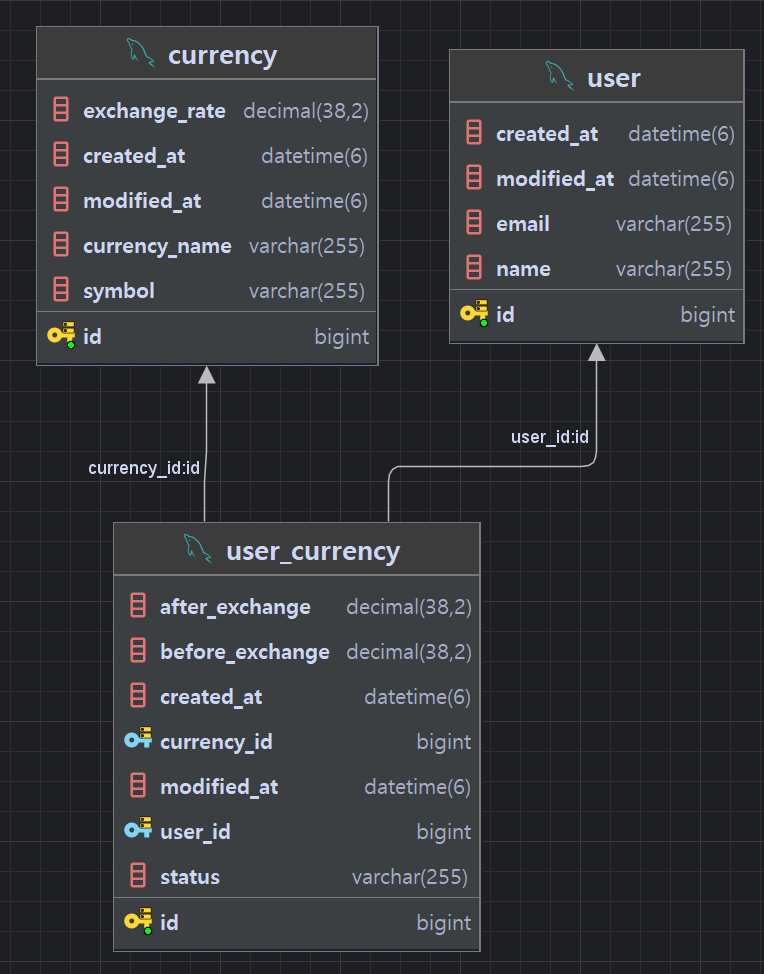
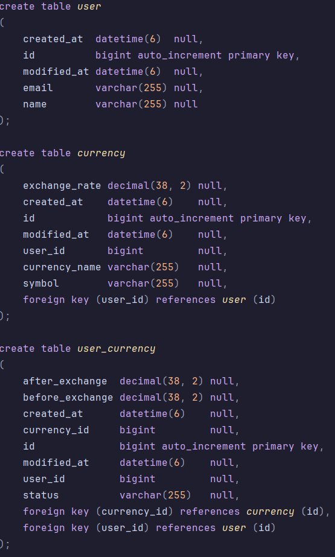

# 통화 환전 API

등록된 사용자와 통화 정보를 바탕으로 환전 신청과 조회, 취소 및 삭제가 가능한 API 입니다.

JPA 를 활용해 테이블의 연관 관계를 지정하고 중간 테이블을 생성해 환전 신청 정보를 관리할 수 있도록 구현했습니다.

## API 명세서

https://documenter.getpostman.com/view/39403184/2sAYBXCBMh

## ERD

## SQL

